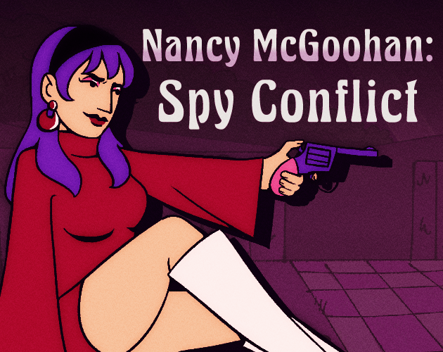

# Nancy McGoohan: Spy Conflict

In Nancy McGoohan: Spy Conflict you play as Nancy McGoohan, an ex-spy for the British Empire, after stealing their secret files and escaping from her former employees. Fight your way to the rendezvous point where your contact awaits!

This is a game (still in development) developed by students from <a href="https://www.imagecampus.edu.ar/">Image Campus</a>

   

## Credits

- **Ruffo Maximiliano** - *Programming*
- **Coccia Lautaro** - *Programming*
- **Mar del Valle** - *Art*
- **Santiago Andrés Ruiz** - *Art*
- **Christian B. Quiroga** - *Sound Designer*
- **Matías Diehl** - *Music Composer*
- **Matías Rodriguez** - *Testing*
- **Lucas Liendro** - *Testing*
- **anonymous** - *Testing*
- **anonymous** - *Testing*

## Tools
- **Unity**
- **Clip Studio Paint**
- **Adobe Photoshop**
- **Visual Studio**
- **Wwise**
- **Studio One**
- **Cubase Pro**

This game was also possible thanks to the support of these professors:

- **Sergio Baretto**
- **Federico Barra**
- **Ramiro Cabrera**
- **Nazareno Rivero**
- **Eugenio Taboada**

## Links

Download it from itch.io: https://maxwell-games.itch.io/nancy-mcgoohan-spy-conflict
